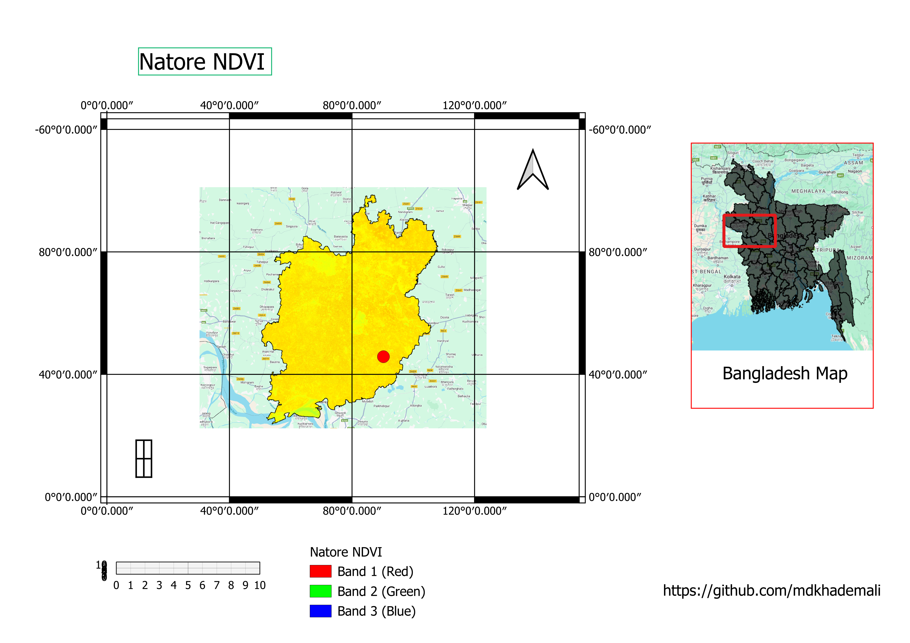

## Natore Zila NDVI Analysis Project

## Overview
This project provides an in-depth analysis of vegetation health in **Natore Zila, Bangladesh** using the **Normalized Difference Vegetation Index (NDVI)**. Utilizing **Google Earth Engine (GEE)** and Sentinel-2 satellite imagery, the project calculates NDVI values, visualizes vegetation health, and generates actionable insights for sustainable agricultural and environmental planning.

## Features
- Full coverage NDVI analysis for the entire Natore Zila region.
- Detailed visualization of vegetation health using a custom color palette.
- Exportable NDVI statistics for further analysis.
- Scalable workflow applicable to other regions and datasets.

## Technologies Used
- **Google Earth Engine (GEE)**
- **Sentinel-2 Imagery**
- **JavaScript** for GEE scripting

## Key Outputs
1. **NDVI Map**: A detailed map of Natore Zila showing variations in vegetation health.
2. **Custom Color Palette**: Visual representation of NDVI values with colors:
   - Green: Low vegetation or barren land.
   - Yellow/Orange: Moderate vegetation health.
   - Red: Dense and healthy vegetation.
3. **Statistical Analysis**: Exported mean NDVI values for the region.

## Screenshots
Below are screenshots of the NDVI map generated for Natore Zila:

### Screenshot 1: Full NDVI Map

### Screenshot 2: Detailed NDVI Visualization
